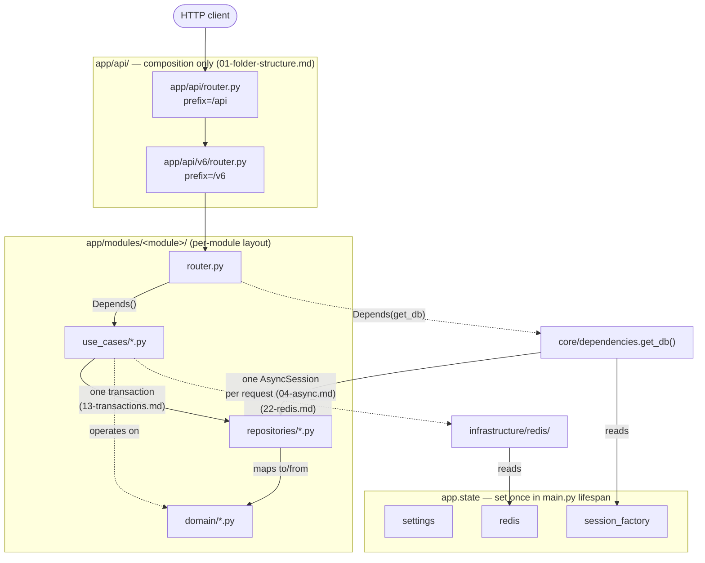

# Architecture: layering and `app.state`

This documents the architecture as it already exists — it's a diagram, not a
proposal. Every edge here corresponds to a rule already in `.claude/rules/`;
where useful, the rule file is named directly on the diagram.

## What this diagram deliberately doesn't show

- **Exception flow.** A failure in `Repository` or `UseCase` propagates
  upward and is translated to an HTTP response in exactly one place —
  `app/core/exception_handlers.py`, not shown here since it isn't part of
  the request's happy-path layering. See
  [`docs/decisions/0003-global-exception-handlers-own-http-translation.md`](decisions/0003-global-exception-handlers-own-http-translation.md).
- **Every rule this architecture enforces** — this is the layering shape,
  not the full rule set. See `.claude/rules/` for everything else
  (logging, validation, security, testing).
- **The skip-level import gap** noted in `api/pyproject.toml`'s
  `[tool.importlinter]` — a router importing a repository directly,
  bypassing the use case, isn't drawn as forbidden here because the
  current enforcement (import-linter's layers contract) doesn't actually
  catch that specific case either. The diagram shows the intended shape;
  it doesn't claim more enforcement than exists.

## Enforcement, not just diagram

What actually checks this shape today, per Milestone 3/5's CI:

- `import-linter` (`api/pyproject.toml`) — router/use_cases/repositories/domain
  layering, and `app/api/` composition-only.
- `api/tests/test_architecture_boundaries.py` — repositories never call
  `commit()`/`rollback()`.
- `api/tests/test_async_session_concurrency.py` — a real `AsyncSession`
  rejects concurrent queries, reproducing 04-async.md's hazard directly
  rather than asserting it.
